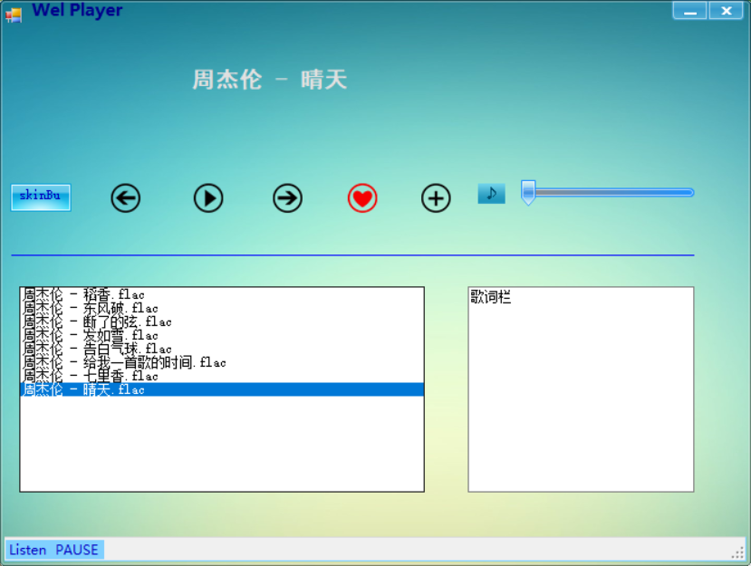

# Frequently Asked Questions

## Motivation

在我大一第一次接触 **程序设计** 这门课时，和大部分同学一样，使用的教材是谭浩强老师的那本绿皮书 —— 《c语言程序设计》，从此开启了我的码农人生。然而，过去了好几个月，我发现计算机专业和我想象中的不太一样，那时候我在想：等我工作了，真的要每天面对 i++ 和 ++i，i+++j+++++k++ 之类的无聊问题吗？我写代码是为了什么？我才学疏浅，不敢质疑老师的讲课方式，更不敢质疑培养方案，但是我知道这种学习方式，会快速地将我的学习热情消耗殆尽。

一个偶然的机会，我了解到 GUI 编程的概念，在网上搜索一番，发现 C 语言写界面相当麻烦，而且缺少好用的类库，像 MFC、Qt 之类的对我来说太难了，那时候我连 C++ 语法都不会，只好作罢。再后来，我又了解到 C# 这门语言（当时不知道这是什么语言，所以在很长的一段时间里称它为【C井】），它的语法优雅易懂，自带的标准库也很完善，而且还有配套文档，在我的破笔记本（至今还在服役，4代i5还能再战）上安装好 Visual Studio，我使用内置的 UI 框架 Winform，然后创建了我的第一个音乐播放器，它长这样：

这在今天看来非常简陋，甚至是不完整的，skinButton 换皮肤功能没做好，没有网络访问功能，没有持久化...，但是这对我来说却很有意义，原来这才是编程的感觉，是提出想法，寻找解决方案，编码实现，修复 bug 的过程。

时隔多年，主流的技术栈也改变了许多，如今一个完整的 2C 项目往往采用前后端分离的开发方式，容器化、分布式的部署方式，由于自己的职业方向是后端开发，同时对前端开发也有兴趣，最近想起多年前那个由于要期末考试而搁置的音乐播放器，青春虽有许多遗憾，这些年也经历过很多坎坷，但是我对编程的热爱并没有减少，曾经写的蹩脚代码也未曾变过，就像时间也没过去太久一般。我想将它开发完成，至少在这里，我不能留下遗憾。同时出于学习的目的，为了将自己学过的知识综合运用起来，故而才有了这个项目。

## The origin for the project name

项目名称叫 `learn-music-player` 是因为，我是在向已有的类似项目学习如何开发一个音乐应用，在功能上肯定无法和产品级的音乐应用如QQ音乐、网易云音乐等相比，还有一些开源的第三方播放器借助功能齐全的 API 接口，也能实现非常强大的音乐应用。该项目旨在从零开始，搭建自己的服务器、数据库，创建自己的服务，如果要实现过于复杂的业务，这对我来说不太现实。该项目仅仅出于自己学习的目的，不考虑上线发布。
