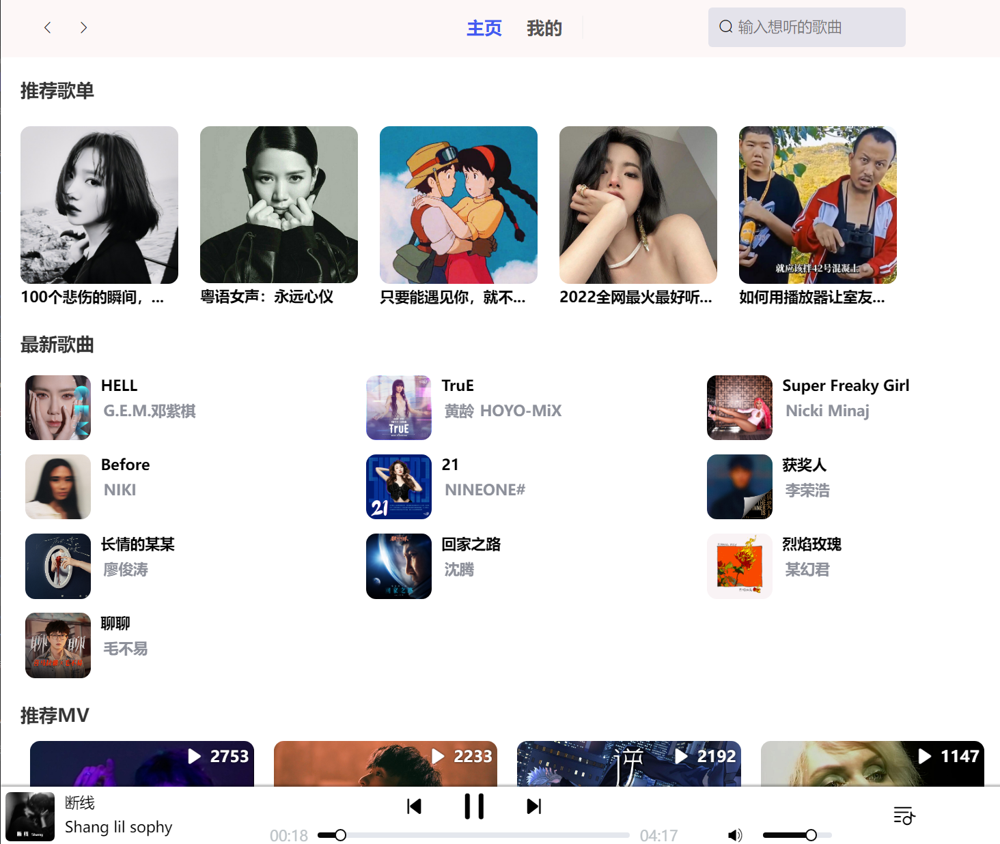

[English](README.md) | [中文](README-CN.md)

# Learn Music Player

📝 [博客主页](https://juejin.cn/user/2594503171769720/posts)
| 📄 [开发文档](doc/overview.md)
| 💬 [常见问题](FAQ.md)
| ⁉ [Issues](https://github.com/Wel2018/learn-music-player/issues)
| 🌍 [项目规划](https://flowus.cn/share/fb7f5722-aedb-494c-a0e7-e4954fa05443#5eb25c4c-b971-4294-bc79-1f97155d6c62)

从零开始，使用微服务架构、前后端分离的开发技术的现代化音乐应用。

## 📖 目录

- [Learn Music Player](#learn-music-player)
  - [📖 目录](#-目录)
  - [💻 客户端示例](#-客户端示例)
  - [✨ 功能](#-功能)
  - [🧱 项目架构](#-项目架构)
  - [🔥 开发环境](#-开发环境)
  - [⛏️ 构建](#️-构建)
  - [📦 相似项目](#-相似项目)
  - [📃 推荐参考项目](#-推荐参考项目)
  - [🍻 贡献方式](#-贡献方式)
  - [📝 开源协议](#-开源协议)

## 💻 客户端示例 

>   注：由于个人精力有限，该项目初期重点是创建 Restful API，暂时客户端使用 [MrRainbowYoo/Music_Player](https://github.com/MrRainbowYoo/Music_Player) 项目提供的实现，此外该项目还列举了一份高质量客户端实现 [清单](#推荐参考项目)。所有接口和配套文档完善后，再提供该项目配套的客户端（包括 Qt、Electron 版本），具体项目规划见 🌍 [项目规划](https://flowus.cn/share/fb7f5722-aedb-494c-a0e7-e4954fa05443#5eb25c4c-b971-4294-bc79-1f97155d6c62)。

## ✨ 功能

该项目会使用 Pyhon、C++ 实现 [网易云音乐 NodeJS 版 API](https://neteasecloudmusicapi.vercel.app/#/?id=neteasecloudmusicapi) 文档中的部分常用接口，并部署自己的数据库，预期功能有：

- 个人账号登录、收藏、评论等
- 支持根据用户喜好推荐歌单、单曲、MV等
- 提供在线、离线模式切换
- 支持 Docker 部署
- 提供中台系统管理音乐歌单、MV、用户等
- ...

详情见 🌍 [项目规划](https://flowus.cn/share/fb7f5722-aedb-494c-a0e7-e4954fa05443#5eb25c4c-b971-4294-bc79-1f97155d6c62)。

## 🧱 项目架构

## 🔥 开发环境

- 编辑器: vscode
- 语言：C++、Python
- 存储：MySQL、Redis
- 接入层：Nginx
- 客户端：Vue.js

## ⛏️ 构建

该项目支持传统方式构建，同时也支持 Docker 部署，详情见 [build](build.md)。

## 📦 相似项目

-   [Binaryify/NeteaseCloudMusicApi: 网易云音乐 Node.js API service (github.com)](https://github.com/Binaryify/NeteaseCloudMusicApi)

## 📃 推荐参考项目

- [MrRainbowYoo/Music_Player: 🎵基于Vue的在线音乐播放器，部分UI参考网易云音乐，支持在线演示。本项目仅供参考学习。 (github.com)](https://github.com/MrRainbowYoo/Music_Player)
- [Yin-Hongwei/music-website: 🎧 Vue + SpringBoot + MyBatis 音乐网站 (github.com)](https://github.com/Yin-Hongwei/music-website) 
- [xiaozhu188/electron-vue-cloud-music: 🚀Electron + Vue 仿网易云音乐windows客户端 (github.com)](https://github.com/xiaozhu188/electron-vue-cloud-music)
- [caijinyc/vue-music-webapp: A Music WebApp based on the Vue. (github.com)](https://github.com/caijinyc/vue-music-webapp)
- [SmallRuralDog/electron-vue-music: 基于 electron-vue 开发的音乐播放器，界面模仿QQ音乐，技术栈electron-vue+vue+vuex+vue-router+element- UI。欢迎star (github.com)](https://github.com/SmallRuralDog/electron-vue-music)
- [SmallRuralDog/vue3-music: VUE3+TS 开发的音乐播放器，界面模仿QQ音乐mac客户端，支持黑夜模式 (github.com)](https://github.com/SmallRuralDog/vue3-music)
- [sl1673495/vue-netease-music: 🎵 基于 Vue2、Vue-CLI3 的高仿网易云 mac 客户端播放器（PC） Online Music Player (github.com)](https://github.com/sl1673495/vue-netease-music)
- [SevenOutman/vue-aplayer: Easy-to-use music player for Vue 2.x (github.com)](https://github.com/SevenOutman/vue-aplayer)
- [maomao1996/Vue-mmPlayer: 🎵 基于 Vue 的在线音乐播放器（PC） Online music player (github.com)](https://github.com/maomao1996/Vue-mmPlayer)
- [qier222/YesPlayMusic: 高颜值的第三方网易云播放器，支持 Windows / macOS / Linux (github.com)](https://github.com/qier222/YesPlayMusic)
- [powerdong/Music-player: Vue高仿网易云音乐(Vue入门实践)——在线预览 -- 暂时停止 (github.com)](https://github.com/powerdong/Music-player)
- [fudaosheng/Vue-NeteaseCloud-WebMusicApp: Vue高仿网易云音乐，基本实现网易云所有音乐、MV相关功能，现已更新到第二版，仅用于学习，下面有详细教程。 (github.com)](https://github.com/fudaosheng/Vue-NeteaseCloud-WebMusicApp)
- [microzz/vue-music-player: 🎵Vue.js写一个音乐播放器+📖One(一个).A music player + One by Vue.js (github.com)](https://github.com/microzz/vue-music-player)
- [boyan01/flutter-netease-music: flutter music player application. (仿网易云音乐) (github.com)](https://github.com/boyan01/flutter-netease-music)
- [ddqre12345/vue-music: cloud-music(网易云音乐) (github.com)](https://github.com/ddqre12345/vue-music)
- [hua1995116/musiccloudWebapp: vuejs仿网易云音乐 (github.com)](https://github.com/hua1995116/musiccloudWebapp)
- [jsososo/NeteaseMusic: 网易云音乐 & QQ音乐 & 咪咕音乐 第三方 web端 (可播放 vip、下架歌曲) (github.com)](https://github.com/jsososo/NeteaseMusic)
- [ShanaMaid/vue-163-music: 【停止维护】网易云音乐web版，支持PC端常用功能，localStorage保存播放列表 (github.com)](https://github.com/ShanaMaid/vue-163-music)
- [lang1427/vue-typescript-music: 基于 vue 全家桶 音乐项目(Music project) vue+typescript 实现 高仿 网易云音乐 移动端WebApp (github.com)](https://github.com/lang1427/vue-typescript-music)
- [sanjings/music-pc: 基于vue3+vite+typescript开发的仿网易云音乐web-pc端 (github.com)](https://github.com/sanjings/music-pc)
- [Francis1024/NeteaseMusic: Vue-Cli 3 + Vuex + Vant UI 的移动端网易云音乐 (github.com)](https://github.com/Francis1024/NeteaseMusic)
- [Nele7/music: 🎵vue 像素级还原mac客户端网易云音乐 (github.com)](https://github.com/Nele7/music)
- [LaravelChen/vue-music: 基于Laravel5.3+Vue2.0的网易云音乐的SPA应用 (github.com)](https://github.com/LaravelChen/vue-music)
- [sunzongzheng/music: electron跨平台音乐播放器；可搜网易云、QQ音乐、虾米音乐；支持QQ、微博、Github登录，云歌单; 支持一键导入音乐平台歌单](https://github.com/sunzongzheng/music) 
- …

## 🍻 贡献方式

欢迎感兴趣的朋友 ⭐ star 该项目，您的支持是我继续更新下去的最大动力！由于本人水平、精力有限，文档、博客和相关代码可能存在疏漏之处，
欢迎在 ⁉ [Issues](https://github.com/Wel2018/learn-music-player/issues) 中提问和讨论，
也欢迎有能力的大佬直接 Pull Request。

> ⚠ 说明：由于考虑到音乐版权和相关法律法规，网易云音乐的相关访问代码已删除。如发现其他问题，还请在 Issues 中指出，谢谢！

## 📝 开源协议

[MIT](LICENSE)

