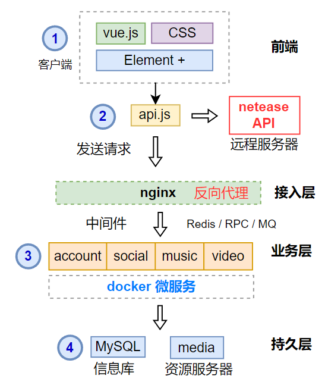

[English](README.md) | [中文](README-CN.md)

# Learn Music Player

📝 [Blog](https://juejin.cn/user/2594503171769720/posts)
| 📄 [Documentation](doc/overview.md)
| 💬 [FAQ](FAQ.md)
| ⁉ [Issues](https://github.com/Wel2018/learn-music-player/issues)
| 🌍 [Roadmap](https://flowus.cn/share/fb7f5722-aedb-494c-a0e7-e4954fa05443#5eb25c4c-b971-4294-bc79-1f97155d6c62)

Create your own music App from scratch.

## 📖 Table of Contents

- [Learn Music Player](#learn-music-player)
  - [📖 Table of Contents](#-table-of-contents)
  - [💻 Client](#-client)
  - [✨ Features](#-features)
  - [🧱 Architecture](#-architecture)
  - [🔥 Technology Stack](#-technology-stack)
  - [⛏️ Build](#️-build)
  - [📦 Related Efforts](#-related-efforts)
  - [📃 Recommended References](#-recommended-references)
  - [🍻 Contributing](#-contributing)
  - [📝 License](#-license)

## 💻 Client 

**note**: 
Due to limited personal energy, the initial focus of the project is to create *Restful API*. 
The implementation of temporary client of this project use [MrRainbowYoo/Music_Player](https://github.com/MrRainbowYoo/Music_Player) project. Besides, some high quality client implementations are list in [recommended-references](#recommended-references) section. When all API and supporting documents are completed, the client supporting the project, including Qt and Electron versions, will be provided. Specific project planning see 🌍 [roadmap](https://flowus.cn/share/fb7f5722-aedb-494c-a0e7-e4954fa05443#5eb25c4c-b971-4294-bc79-1f97155d6c62).

## ✨ Features

This project use Python, C++ server to implement the common interface in [netease-cloudmusic api](https://neteasecloudmusicapi.vercel.app/#/?id=neteasecloudmusicapi) document. Expected features are:

- Personal account, favorites, comments, etc
- Recommend playlists, singles, and MV based on users' preferences
- Provides switching between online and offline modes
- Support Docker deployment
- Provide mid-stage system to manage music playlists, MV, users, etc
- ...

For more details, see [Roadmap](https://flowus.cn/share/fb7f5722-aedb-494c-a0e7-e4954fa05443#5eb25c4c-b971-4294-bc79-1f97155d6c62). 

## 🧱 Architecture

## 🔥 Technology Stack

- Editor: Visual Studio Code
- Language：C++, Python 
- Database：MySQL, Redis
- Access layer：Nginx
- Client：Vue.js

## ⛏️ Build 

The project supports traditional builds as well as Docker deployments. For more details, see [build](build.md).

## 📦 Related Efforts

-   [Binaryify/NeteaseCloudMusicApi: 网易云音乐 Node.js API service (github.com)](https://github.com/Binaryify/NeteaseCloudMusicApi)

## 📃 Recommended References

- [MrRainbowYoo/Music_Player: 🎵基于Vue的在线音乐播放器，部分UI参考网易云音乐，支持在线演示。本项目仅供参考学习。 (github.com)](https://github.com/MrRainbowYoo/Music_Player)
- [Yin-Hongwei/music-website: 🎧 Vue + SpringBoot + MyBatis 音乐网站 (github.com)](https://github.com/Yin-Hongwei/music-website) 
- [xiaozhu188/electron-vue-cloud-music: 🚀Electron + Vue 仿网易云音乐windows客户端 (github.com)](https://github.com/xiaozhu188/electron-vue-cloud-music)
- [caijinyc/vue-music-webapp: A Music WebApp based on the Vue. (github.com)](https://github.com/caijinyc/vue-music-webapp)
- [SmallRuralDog/electron-vue-music: 基于 electron-vue 开发的音乐播放器，界面模仿QQ音乐，技术栈electron-vue+vue+vuex+vue-router+element- UI。欢迎star (github.com)](https://github.com/SmallRuralDog/electron-vue-music)
- [SmallRuralDog/vue3-music: VUE3+TS 开发的音乐播放器，界面模仿QQ音乐mac客户端，支持黑夜模式 (github.com)](https://github.com/SmallRuralDog/vue3-music)
- [sl1673495/vue-netease-music: 🎵 基于 Vue2、Vue-CLI3 的高仿网易云 mac 客户端播放器（PC） Online Music Player (github.com)](https://github.com/sl1673495/vue-netease-music)
- [SevenOutman/vue-aplayer: Easy-to-use music player for Vue 2.x (github.com)](https://github.com/SevenOutman/vue-aplayer)
- [maomao1996/Vue-mmPlayer: 🎵 基于 Vue 的在线音乐播放器（PC） Online music player (github.com)](https://github.com/maomao1996/Vue-mmPlayer)
- [qier222/YesPlayMusic: 高颜值的第三方网易云播放器，支持 Windows / macOS / Linux (github.com)](https://github.com/qier222/YesPlayMusic)
- [powerdong/Music-player: Vue高仿网易云音乐(Vue入门实践)——在线预览 -- 暂时停止 (github.com)](https://github.com/powerdong/Music-player)
- [fudaosheng/Vue-NeteaseCloud-WebMusicApp: Vue高仿网易云音乐，基本实现网易云所有音乐、MV相关功能，现已更新到第二版，仅用于学习，下面有详细教程。 (github.com)](https://github.com/fudaosheng/Vue-NeteaseCloud-WebMusicApp)
- [microzz/vue-music-player: 🎵Vue.js写一个音乐播放器+📖One(一个).A music player + One by Vue.js (github.com)](https://github.com/microzz/vue-music-player)
- [boyan01/flutter-netease-music: flutter music player application. (仿网易云音乐) (github.com)](https://github.com/boyan01/flutter-netease-music)
- [ddqre12345/vue-music: cloud-music(网易云音乐) (github.com)](https://github.com/ddqre12345/vue-music)
- [hua1995116/musiccloudWebapp: vuejs仿网易云音乐 (github.com)](https://github.com/hua1995116/musiccloudWebapp)
- [jsososo/NeteaseMusic: 网易云音乐 & QQ音乐 & 咪咕音乐 第三方 web端 (可播放 vip、下架歌曲) (github.com)](https://github.com/jsososo/NeteaseMusic)
- [ShanaMaid/vue-163-music: 【停止维护】网易云音乐web版，支持PC端常用功能，localStorage保存播放列表 (github.com)](https://github.com/ShanaMaid/vue-163-music)
- [lang1427/vue-typescript-music: 基于 vue 全家桶 音乐项目(Music project) vue+typescript 实现 高仿 网易云音乐 移动端WebApp (github.com)](https://github.com/lang1427/vue-typescript-music)
- [sanjings/music-pc: 基于vue3+vite+typescript开发的仿网易云音乐web-pc端 (github.com)](https://github.com/sanjings/music-pc)
- [Francis1024/NeteaseMusic: Vue-Cli 3 + Vuex + Vant UI 的移动端网易云音乐 (github.com)](https://github.com/Francis1024/NeteaseMusic)
- [Nele7/music: 🎵vue 像素级还原mac客户端网易云音乐 (github.com)](https://github.com/Nele7/music)
- [LaravelChen/vue-music: 基于Laravel5.3+Vue2.0的网易云音乐的SPA应用 (github.com)](https://github.com/LaravelChen/vue-music)
- [sunzongzheng/music: electron跨平台音乐播放器；可搜网易云、QQ音乐、虾米音乐；支持QQ、微博、Github登录，云歌单; 支持一键导入音乐平台歌单](https://github.com/sunzongzheng/music) 
- …

## 🍻 Contributing

Welcome all friends who are interested in Music-Player to ⭐ star this project. Your support is the biggest motivation for me to continue updating!
Due to my level and energy are limited, the blogs and related code may have inadequacies and errors, welcome to ask questions and discussion in ⁉ [Issues](https://github.com/Wel2018/learn-cpp-rezero/issues), also welcome to **Pull Requests** when you make sure which are not already open.

>   ⚠ Note: Due to the consideration of music copyright and relevant laws and regulations, the relevant access code of NetEase Cloud Music has been deleted. If you find any other problems, please refer to Issues. Thank you!

## 📝 License  

MIT License (for more details, see the [license file](LICENSE))

