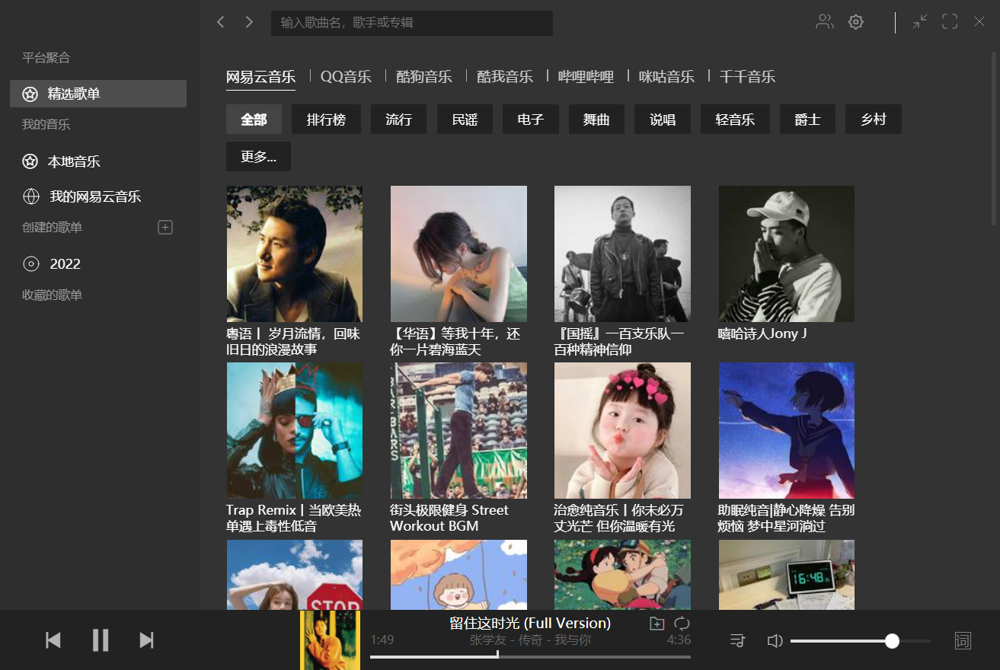
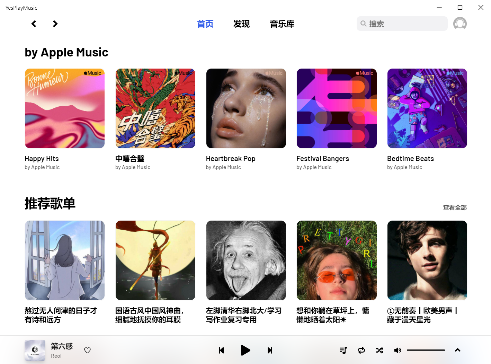

# UI Design

## 常见的界面布局

在创建音乐音乐之前，首先要构思一下自己的 Music Player 大概长什么样子，如果不擅长 UI 设计，可以先参考一些 Github 上开源的热门音乐应用：

### Listen1

Listen1 是极简风格的，值得借鉴的地方：

- 前进、回退标志
- 居中搜索栏
- 提供单独的设置页
- 简单高效的 Tab 栏
- 音乐播放器布局合理

### LX 洛雪音乐

洛雪音乐的界面布局亮点有：

- 收缩的侧边栏，节省空间
- 提供多种交互动态特效
- 支持按照不同音质下载

### YesPlayMusic

亮点：

- 毛玻璃特效
- 极简的界面，取消左侧导航栏，改到顶部标签栏

## 该项目的界面布局

基于 @MrRainbowYoo 的 [MrRainbowYoo/Music_Player](https://github.com/MrRainbowYoo/Music_Player)  样式，
再根据我个人喜好调整后得到如下界面布局：

